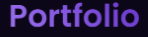
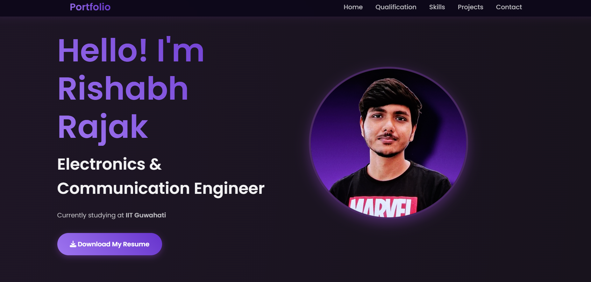
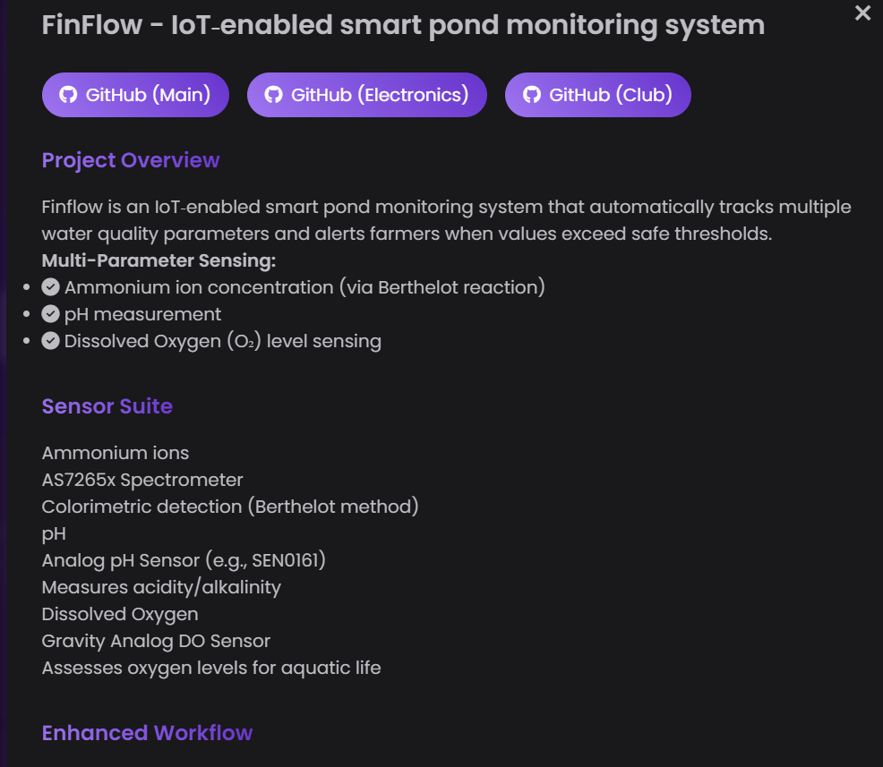
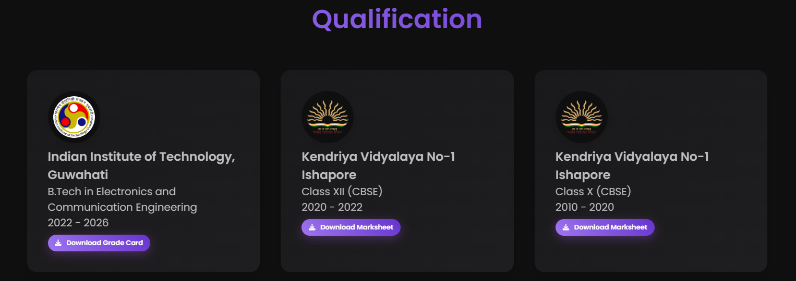

# 🚀 Rishabh Rajak | Portfolio

Welcome to my personal portfolio!  
This site showcases my education, skills, projects, and achievements as an Electronics & Communication Engineer at IIT Guwahati.



---

## ✨ Features

- **Modern Responsive Design** – Built with HTML, CSS (custom gradients, animations), and JavaScript.
- **Animated Sections** – Smooth fade-ins, floating hero, and interactive cards.
- **Projects Gallery** – Clickable project cards with modals for details and links.
- **Education Timeline** – Downloadable marksheets and grade cards.
- **Skills Section** – Animated, visually grouped skills.
- **Contact & Socials** – Quick links to connect via phone, email, LinkedIn, GitHub, and Instagram.
- **PDF Viewer** – View and download marksheets and resume in-app.
- **Dark Themed UI** – Eye-friendly color palette with gradients and glassmorphism touches.
- **Scroll to Top** – Floating button for easy navigation.

---

## 🖼️ Screenshots

| Home / Hero Section | Projects Modal | Education & Downloads |
|---------------------|---------------|-----------------------|
|  |  |  |

---

## 🛠️ Tech Stack

- **Frontend:**  
  - HTML5, CSS3 (custom, gradients, animations)
  - JavaScript (vanilla)
  - [Font Awesome](https://fontawesome.com/) for icons
  - Google Fonts: [Poppins](https://fonts.google.com/specimen/Poppins)
- **Assets:**  
  - Custom images, GIFs, and downloadable PDFs

---
## 🚀 Demo

[**Live Demo 1**](https://rishabh028.github.io/Portfolio.github.io/)         -   |   -          [**Live Demo 2**](https://pixel-pulse-studio-96.lovable.app/)  

---

## 🚦 Getting Started

1. **Clone this repository:**
   ```bash
   git clone https://github.com/Rishabh028/Portfolio.git
   cd Portfolio
